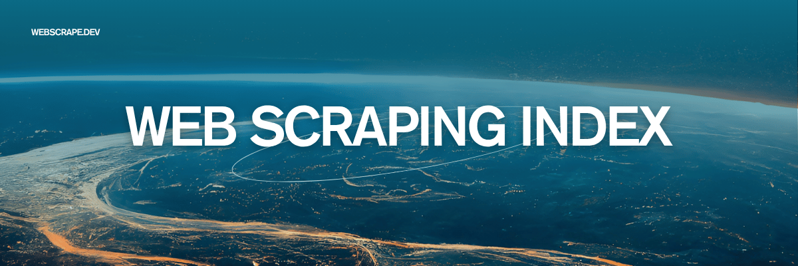

<!-- title -->

# Web Scraping Index

<!-- subtitle -->

A curated list of tools, frameworks, and resources for web scraping.

<!-- image -->

This repository, `web-scraping-index` 🕸️, is a comprehensive, community-curated list of web scraping tools, updated weekly. It serves as the data backbone for the upcoming [webscrape.dev](https://webscrape.dev) website.

[webscrape.dev](https://webscrape.dev) will be the go-to resource for web scraping professionals, featuring in-depth tool reviews, comparisons, and a quarterly "Web Scraping Landscape" report.

We welcome community contributions! If you know of a tool that's not listed, please feel free to submit a pull request.
<!-- description -->
<!-- TOC -->

## Contents

- [How to Contribute](#how-to-contribute)
- [AI-Powered Scrapers](#ai-powered-scrapers)
- [Web Scraping Frameworks & Libraries](#web-scraping-frameworks--libraries)
- [Browser Automation Tools](#browser-automation-tools)
- [No-Code & Low-Code Platforms](#no-code--low-code-platforms)
- [Data Extraction & Processing](#data-extraction--processing)
- [Proxy & Captcha Services](#proxy--captcha-services)
- [Benchmarks & Research](#benchmarks--research)
- [Tutorials & Guides](#tutorials--guides)
- [Join the Community](#join-the-community)
- [Contributing](#contributing)
  - [Contributors](#contributors)

<!-- CONTENT -->

## How to Contribute
We welcome community contributions! If you know of a tool that's not listed, please feel free to [open a pull request](https://github.com/webscrape-dev/web-scraping-index/pulls). For more information, please see our [contribution guidelines](contributing.md).

## 🕸️ Featured Tools

Want to get your tool featured? [Contact us](mailto:hello@webscrape.dev).

- [AgentGPT by Reworkd](https://agentgpt.reworkd.ai/)  - Deploy autonomous AI agents in your browser.
- [Browserbase](browserbase.com)  - Cloud infrastructure platform providing scalable browser instances and APIs for web automation and testing.

## AI-Powered Web Agent

Tools that leverage AI to autonomously browse and interact with websites, often understanding natural language commands to perform complex tasks.

- [AgentQL](https://www.agentql.com/)  - Query language and toolkit that makes the web AI-ready.
- [Manus](https://manus.im/) - General AI agent capable of executing long-running tasks across browsers, terminals, and text editors.
- [OmniParser by Microsoft](https://microsoft.github.io/OmniParser/)  - Tool for parsing GUIs to enable vision-based agents.
- [Playwright Browser Toolkit by LangChain](https://python.langchain.com/docs/integrations/tools/playwright/#use-within-an-agent)  - Toolkit integration enabling AI agents to control browsers.
- [Silverstream AI](https://www.silverstream.ai/) - Infrastructure and tools for developing autonomous web agents with privacy and user alignment focus.

## Web Automation Framework

Libraries and frameworks for developers to programmatically control web browsers and build custom automation scripts (e.g., Playwright, Selenium).

- [Agent-E by Emergence AI](https://www.emergence.ai/web-automation-api)  - Agent framework with HTML DOM distillation capabilities.
- [Browser Use](https://www.browser-use.com/)  - State-of-the-art agent framework making the web LLM-friendly with autonomous navigation.
- [Bytebot](https://github.com/bytebot-ai/bytebot)  - Containerized computer use agent framework with AI-powered scraping capabilities.
- [CloudCruise](https://www.cloudcruise.com/) - Simple workflow design and API system for building fast and reliable web agents.
- [DataFuel.dev](https://www.datafuel.dev) - API transforming websites into clean, LLM-ready data in markdown and structured formats.
- [DataHive](https://datahive.ai/) - Distributed data platform helping AI companies access hard-to-reach public and private data.
- [Exa](https://exa.ai) - AI-powered web search API using advanced representation learning for intelligent information discovery.
- [Expand.ai](https://www.expand.ai/)  - Platform converting websites into type-safe APIs.
- [Firecrawl](https://www.firecrawl.dev/)  - APIs for converting websites into LLM-friendly markdown.
- [LLM Scraper](https://github.com/mishushakov/llm-scraper)  - Intelligent scraping tool using LLMs for content understanding.
- [LaVague](https://www.lavague.ai/)  - Framework enabling natural language web automation.
- [Lightfeed](https://lightfeed.ai)  - AI-powered platform using LLMs to extract and structure data from any website.
- [Multilogin](multilogin.com) - Advanced browser fingerprinting protection and multi-account management solution.
- [Scrapfly](https://scrapfly.io)  - Comprehensive data collection APIs including web scraping and AI-powered extraction.
- [Self-Operating Computer Framework by OthersideAI](https://github.com/OthersideAI/self-operating-computer)  - Framework enabling multimodal models to operate computers.
- [Skyvern](https://www.skyvern.com/)  - Framework for automating browser-based workflows.
- [Stagehand by Browserbase](https://www.stagehand.dev/)  - AI web browsing framework.
- [Upscrape](https://www.upscrape.com) - High-performance web scraping systems and automation workflows for data collection.
- [WebAgent by OpenAgents](https://github.com/xlang-ai/OpenAgents)  - Web-browsing agent module enabling autonomous website navigation.
- [WebRobot Ltd](http://www.webrobot.eu) - Big data and AI company specializing in automated web scraping and dataset creation.
- [rtrvr.ai](https://www.rtrvr.ai/) - AI Web Agent Chrome Extension for autonomous task execution and data scraping.

## No-Code Web Automation Platform

Platforms that enable users to create and manage web automation workflows through a graphical user interface, without writing any code.

- [CopyCat](https://www.runcopycat.com/) - No-code browser automation platform converting screen recordings into reusable workflows.

## Browser Extension

Tools that operate as add-ons or extensions within a web browser to provide automation, scraping, or other functionalities.

- [Bardeen AI](https://bardeen.ai/) - Chrome extension enabling AI-powered browser automations and workflow creation.
- [BrowseGPT](https://browsegpt.ai/) - Browser extension providing page summaries and Q&A capabilities.
- [Browser MCP](https://autobrowser.ai/)  - Free Chrome extension using Claude Computer Use for browser automation.
- [Do Browser](https://www.dobrowser.io/) - AI-powered Chrome extension understanding natural language for browser automation.
- [HARPA AI](https://harpa.ai/) - AI-powered Chrome extension and browser agent for natural language task execution.
- [Nanobrowser](https://nanobrowser.ai/)  - Open-source AI web agent Chrome extension with flexible LLM options.
- [VimGPT](https://github.com/ishan0102/vimGPT)  - Experimental project using GPT-4 Vision for web browsing via Vimium.

## Headless Browser API/Service

Cloud-based services that provide programmatic access to headless browsers, allowing for scalable web scraping and automation without managing infrastructure.

- [BrowserCat](https://www.browsercat.com)  - Headless browser API for automating web tasks including scraping and testing.
- [Browserless](browserless.io)  - Cloud-based headless browser automation and web scraping infrastructure.
- [Surfsky](https://surfsky.io) - Browser automation tool using real fingerprints for undetected web scraping.

## Data Extraction API

APIs specifically designed to extract structured data from web pages, often handling the complexities of scraping and parsing.

- [Browse AI](https://www.browse.ai/) - Chrome extension for web scraping with AI-powered structured data extraction.
- [DEX8](https://www.dex8.com) - Cloud-based web scraping platform deploying unlimited robots for real-time data collection.
- [Forage AI](http://www.forage.ai) - Data extraction platform transforming unstructured web data into structured insights.
- [X-Byte Enterprise Crawling](https://www.xbyte.io/) - Managed web scraping platform aggregating data from thousands of sources.
- [eScraper](https://e-scraper.com/) - Comprehensive web scraping platform for data extraction and gathering.

## Web Scraping Platform

Comprehensive platforms that offer a suite of tools for web scraping, often including features like proxy management, scheduling, and data processing.

- [Asteroid](https://asteroid.ai/) - Hosted Browser Agents for automating complex workflows in SMEs.
- [AutoGPT](https://github.com/Significant-Gravitas/AutoGPT)  - Experimental agent for task completion and web browsing.
- [Automina](https://automina.app/) - AI browser automation tool with natural language control for enhanced web interaction.
- [Cekura](https://www.cekura.io/) - AI browser agent helping companies maintain up-to-date documentation with intelligent automation.
- [Comet by Perplexity](https://www.perplexity.ai/comet) - AI-powered browser by Perplexity for enhanced web interaction and intelligent browsing.
- [Computer Use by Anthropic](https://www.anthropic.com/news/3-5-models-and-computer-use)  - Advanced computer use agent with comprehensive browser control capabilities.
- [Crawl4AI](https://crawl4ai.com/)  - Open-source LLM-friendly web crawler and scraper for intelligent data extraction.
- [Deta Surf](https://deta.surf/) - Integrated platform combining browser, file manager, and AI assistant with browser-level context awareness.
- [Dex by Dexterity](https://getdexterity.com/) - AI coworker embedding into and controlling your browser for automated workflows.
- [Dia by The Browser Company](https://www.diabrowser.com/) - Innovative web browser built with AI at its core by The Browser Company (Arc).
- [Exa](https://exa.ai/) - AI-powered semantic search engine for intelligent information discovery.
- [Highlight AI](https://highlightai.com/) - Advanced tool enabling AI models to understand and interact with desktop activity.

## Web Scraping Service/Consultancy

Companies that provide 'done-for-you' web scraping services, data extraction as a service, or expert consulting on data acquisition.

- [ABCproxy](ABCproxy.com)  - Proxy server service for secure and anonymous internet browsing.
- [AbstractAPI](abstractapi.com)  - API-first proxy service with IP geolocation tools for web scraping.
- [AirProxy](airproxy.io) - Reliable proxy service for secure browsing and data collection.
- [AnyIP](anyip.io) - Proxy service for IP rotation and geographic location flexibility.
- [Apify](apify.com)  - Web scraping platform with proxy services for data extraction.
- [AstroProxy](astroproxy.com) - Proxy service for secure internet connectivity and data access.
- [BlockMesh](blockmesh.xyz)  - Proxy service for enhanced privacy and connectivity.
- [Browse AI](browse.ai) - Web scraping platform for monitoring websites without coding.
- [Browser Use](browser-use.com) - Proxy service for web browsing and data collection.
- [Browser.ai](https://browser.ai/) - AI-powered web browsing platform for intelligent automation.
- [BrowserCloud](https://browsercloud.io) - High-performance cloud platform for headless Chrome browsers.
- [CloudRouter](cloudrouter.io) - Proxy infrastructure for distributed systems.
- [Coronium](coronium.io) - Proxy service for web scraping and data collection.
- [Data Scraping Services](https://www.datascrapingservices.com/) - Comprehensive web scraping solutions across multiple industries.
- [DataForSEO](dataforseo.com) - Enterprise-grade proxy solutions for SEO professionals.
- [DataHen](https://www.datahen.com) - Enterprise-grade web scraping and data extraction services.
- [DataImpulse](dataimpulse.com) - High-performance proxy solutions for web scraping.
- [DataMiners.co](https://dataminers.co) - Intelligent web scraping and data extraction systems.
- [Databay](databay.com) - Proxy services for web scraping and data collection.
- [Datrock](https://datrock.co/) - Web scraping consultancy for high-quality structured data.
- [EZProxies](ezproxies.com) - Proxy server service for anonymous web browsing.
- [Evomi](evomi.com)  - Proxy service for IP rotation and geo-location.
- [Flipnode](flipnode.io) - Proxy service for IP rotation and web scraping.
- [Froxy](froxy.com) - Proxy server service for secure browsing and data collection.
- [GeoSurf](geosurf.com) - Premium proxy service for accessing geo-restricted content.
- [Geonode](geonode.com) - Proxy service for web scraping and data collection.
- [HasData](hasdata.com)  - Proxy services for enterprise-level data acquisition.
- [High Proxies](highproxies.com) - High-performance proxy infrastructure for web scraping.
- [HydraProxy](hydraproxy.com) - Proxy server service for secure browsing and data access.
- [IPBurger](ipburger.com) - Proxy service for secure browsing and data collection.
- [IPRoyal](iproyal.com) - Residential and datacenter proxy services with global coverage.
- [IPWay](ipway.com) - Proxy service for IP rotation and web scraping.
- [Incogniton](incogniton.com) - Anti-detection browser solution for multiple identities.
- [Indext Data Lab](http://finddatalab.com) - No-code web scraping solution for structured data.
- [Infatica](infatica.io) - Proxy infrastructure for secure web access and data collection.
- [Instant Proxies](instantproxies.com) - Fast proxy service for secure internet connections.
- [LiveProxies](liveproxies.io) - Proxy server solutions for secure internet connections.
- [LumiProxy](lumiproxy.com) - Professional proxy services for web scraping.
- [LunaProxy](lunaproxy.com) - Proxy service for secure internet access and data collection.
- [Mars Proxies](marsproxies.com) - Proxy server service for internet traffic routing.
- [MassProxy](massproxy.com) - Proxy server service for enhanced privacy.
- [Massive](joinmassive.com) - Residential and datacenter proxy solutions for web scraping.
- [Mellowtel](mellowtel.com)  - Proxy service for secure web scraping and browsing.
- [Mint Data](https://mint-data.co/) - Web scraping and AI solutions for market insights.
- [NaProxy](naproxy.com) - Residential and datacenter proxy solutions for web scraping.
- [Nexusnet](nexusnet.io) - Proxy service for network routing and connectivity.
- [No-Code Scraper](https://nocodescraper.com) - AI-powered web scraping tool without coding.
- [NodeMaven](nodemaven.com) - Enterprise-grade proxy services for web data access.
- [NodePay](nodepay.ai) - Proxy service for web scraping and data collection.
- [Oculus Proxies](oculusproxies.com) - Proxy server service for IP masking.
- [OmegaProxy](omegaproxy.com) - Proxy server solutions for secure internet access.
- [OpenWeb Ninja](https://www.openwebninja.com) - Real-time public data and SERP APIs.
- [PIA Proxy](piaproxy.com) - Residential and datacenter proxy solutions with global coverage.
- [PacketStream](packetstream.io)  - Residential proxy network for web scraping.
- [Proxy Bonanza](proxybonanza.com) - Proxy server service for secure browsing.
- [Proxy Empire](proxyempire.io) - Enterprise-grade proxy services with global coverage.
- [Proxy-Cheap](proxy-cheap.com) - Affordable proxy services for IP rotation.
- [Rayobyte](rayobyte.com) - Enterprise-grade proxy services for web scraping.
- [Repocket](repocket.co) - Residential and datacenter proxy solutions.
- [Rotating Proxies](rotatingproxies.com) - Rotating proxy service for web scraping.
- [SOAX](soax.com) - Premium proxy service for IP rotation and data collection.
- [ScrapeNinja](https://scrapeninja.net) - API-first web scraping service for developers.
- [ScrapeOwl](scrapeowl.com) - Proxy service for unrestricted web data access.
- [ScrapeSmart](https://scrapesmart.io) - Global web scraping consultancy with 10+ years experience.
- [ScrapeUnblocker](https://www.scrapeunblocker.com/) - Web scraping service bypassing captchas and anti-bot measures.
- [Scrapelabs](http://try.scrapelabs.io/) - Done-for-you web scraping services without contracts.
- [Scrapeless](scrapeless.com) - Enterprise-grade web scraping solutions for large-scale data.
- [ScraperBox](scraperbox.com) - Proxy service specifically for web scraping operations.
- [Scraping Bot](scraping-bot.io) - Proxy service for web scraping and data extraction.
- [ScrapingAnt](https://scrapingant.com)  - Simple web scraping API with proxy rotation.
- [ScrapingBee](scrapingbee.com) - Web scraping API service with proxy management.
- [ScrapingFish](scrapingfish.com) - Proxy service for reliable web data scraping.
- [Scrappey](scrappey.com) - Proxy service for web data access and collection.
- [SerpApi](https://serpapi.com/) - Search API providing Google Search results for AI agents.
- [SerpWow](serpwow.com) - Proxy service for web scraping and data collection.
- [Serper](serper.dev) - Google Search API service for developers.
- [Shifter](shifter.io) - Residential and datacenter proxy solutions.
- [SimplyNode](https://simplynode.io) - Premium residential and mobile proxy services.
- [Smartproxy](smartproxy.com) - Proxy service for secure internet access.
- [Spider Cloud](spider.cloud)  - Proxy service for web scraping and data collection.
- [Spider Network](spider.network) - Proxy provider for web scraping and browsing.
- [Spider](spider.com) - Proxy service for web data access and collection.
- [Squid Proxies](squidproxies.com) - Proxy server solutions for secure browsing.
- [Stabler](https://www.stabler.tech/) - Universal low-code web scraping platform.
- [Storm Proxies](stormproxies.com) - Proxy service for anonymous web browsing.
- [SwiftProxy](swiftproxy.net) - Proxy service for anonymous browsing and access.
- [ThunderProxies](thunderproxies.com) - Proxy service for secure browsing and data collection.
- [VALUE SERP](https://www.valueserp.com) - Low-cost SERP API for SEO applications.
- [Vetric](vetric.io) - Proxy service for geo-restricted content access.
- [WebRobots](webrobots.io) - Proxy service for web scraping and data collection.
- [WebScraping.AI](webscraping.ai)  - AI-powered web scraping service for complex websites.
- [WebScrapingAPI](webscrapingapi.com) - Proxy infrastructure for web scraping services.
- [Zyte](zyte.com) - Enterprise-grade proxy infrastructure for web scraping.

## SERP API

Specialized APIs for scraping search engine results pages (SERPs) from search engines like Google, Bing, etc.

- [Aves API](https://avesapi.com) - Lightning-fast SERP API for real-time data scraping from major search engines.
- [SERPHouse](https://www.serphouse.com)  - Powerful SERP API delivering real-time search engine data through structured JSON.
- [SerpApi](https://serpapi.com/)  - Search API providing Google Search results for AI agents.
- [Serper](https://serper.dev/) - Performant and cost-effective search API for AI agents.

## Proxy Service Provider

Companies that offer proxy servers (e.g., residential, datacenter, mobile) to enable anonymous browsing and bypass IP-based restrictions.

- [GoProxies](goproxies.com) - Proxy server solutions for secure browsing and data collection.
- [Grass](getgrass.io) - Decentralized proxy network for passive income and residential IP access.
- [Infinite Proxies](infiniteproxies.com) - Proxy server solutions for secure browsing and data collection.
- [Kameleo](kameleo.io)  - Browser fingerprinting protection and proxy management solutions.
- [NetNut](netnut.io) - Enterprise-grade proxy solutions with global IP coverage.
- [Nimbleway](nimbleway.com) - Enterprise-grade proxy infrastructure for data collection.
- [NodeProxy](https://nodeproxy.io/) - Fast residential proxy solutions for secure browsing.
- [Octobrowser](octobrowser.net) - Anti-detection browser technology for multiple identities.
- [Oxylabs](oxylabs.io)  - Enterprise-grade proxy solutions for web data extraction.
- [Proxidize](proxidize.com) - Mobile and residential proxy solutions for web scraping.
- [Proxy Omega](proxyomega.com) - Proxy server solutions for secure internet access.
- [Proxy by Convergence](https://convergence.ai/) - AI-powered digital assistant for web exploration.
- [ProxyEmpire](https://proxyempire.io) - Comprehensive proxy solutions across 170+ countries.
- [ProxyRack](proxyrack.com) - Proxy server solutions for secure web browsing.
- [ProxyScrape](proxyscrape.com) - Proxy server solutions for web scraping and browsing.
- [SOAX](https://soax.com) - Intelligent data collection platform with ethical proxy servers.
- [ScraperAPI](scraperapi.com) - Enterprise-grade proxy infrastructure for web scraping.
- [Scrapestack](scrapestack.com) - Proxy infrastructure and web scraping APIs.
- [Scrapfly](scrapfly.io) - Enterprise-grade web scraping infrastructure with proxy rotation.

## Research & Benchmark Dataset

Academic or open-source datasets, environments, and leaderboards for testing, evaluating, and advancing web scraping and agent technologies.

- [Bananalyzer](https://github.com/reworkd/bananalyzer)  - Open-source evaluation framework for web-based AI agents.
- [BrowserGym by ServiceNow](https://github.com/ServiceNow/BrowserGym)  - Gym environment for web task automation.
- [Mind2Web](https://osu-nlp-group.github.io/Mind2Web) - Large-scale dataset for generalist web agents.
- [MiniWoB++ by Farama Foundation](https://miniwob.farama.org/)  - Suite of 104 mini web browser tasks for testing.
- [WebArena](https://webarena.dev/)  - Realistic web environment for autonomous agents with performance tracking.
- [WebCanvas](https://github.com/iMeanAI/WebCanvas)  - Online evaluation framework for testing agents on live websites.
- [WebGPT by OpenAI](https://openai.com/research/webgpt) - OpenAI's browser-assisted question-answering research project.
- [WebGames by Convergence](https://webgames.convergence.ai/) - Collection of challenges for testing web-browsing AI agents.
- [WebVoyager](https://github.com/MinorJerry/WebVoyager)  - Vision-enabled web agent using GPT-4V for website interaction.

<!-- END CONTENT -->

## Interested in Webscrape.dev?
Feel free to reach out at [hello@webscrape.dev](mailto:hello@webscrape.dev?subject=Hello%20from%20github!).

This repository is an [open-source](https://github.com/webscrape-dev/web-scraping-index) project that powers the upcoming [webscrape.dev](https://webscrape.dev).

## Join the Community

<!-- list people worth following on social sites (Twitter, LinkedIn, GitHub, YouTube etc.) -->

- Feel free to reach out to us at [hello@webscrape.dev](mailto:hello@webscrape.dev?subject=Hello%20from%20github!)

## Contributing

[Contributions of any kind welcome, just follow the guidelines](contributing.md)!

### Contributors

[Thanks goes to these contributors](https://github.com/webscrape-dev/web-scraping-index/graphs/contributors)!
